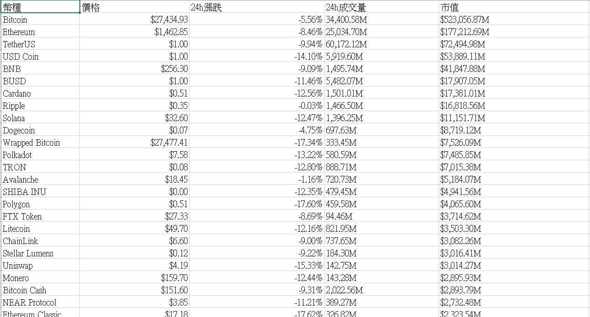

# 期中作業

## 程式碼

```
import urllib.request as req
from bs4 import BeautifulSoup
import csv
import codecs
import json

#因為網站會有反爬蟲的設定，所以header的資訊是為了模擬使用者進入網站
#User-Agent為用戶端資訊
headers = {"User-Agent":"Mozilla/5.0 (Windows NT 10.0; Win64; x64) AppleWebKit/537.36 (KHTML, like Gecko) Chrome/101.0.4951.64 Safari/537.36 Edg/101.0.1210.53"}
#url是要爬蟲的網站的網址
url="https://www.binance.com/zh-TW/markets"
res = req.urlopen(url)
content = res.read().decode("utf-8")


file = codecs.open("data.csv","w","utf-8")  #讀寫模式  w-新建檔案寫入 b-二進位模式
file.write(u'\ufeff')  #防止亂碼
writer = csv.writer(file)
writer.writerow(['幣種','價格','24h漲跌','24h成交量','市值'])
lists = []
parsedata=BeautifulSoup(content,"html.parser") #使用beautifulsoup解析HTML格式
for i in range (30):
    name = parsedata.select('div.css-1ap5wc6')[i].text   # 由html標籤的<div>搜尋class為css-1ap5wc6的項目
    price = parsedata.select('div.css-ydcgk2')[i].text  # 由html標籤的<div>搜尋class為css-ydcgk2的項目
    updown = parsedata.select('div.css-1ca67uc')[i].text  # 由html標籤的<div>搜尋class為css-1ca67uc的項目
    deal = parsedata.select('div.css-102bt5g')[i].text  # 由html標籤的<div>搜尋class為css-102bt5g的項目
    market_value = parsedata.select('div.css-s779xv')[i].text  # 由html標籤的<div>搜尋class為css-s779xv的項目

    lists.append(name) 
    lists.append(price)
    lists.append(updown)
    lists.append(deal)
    lists.append(market_value)
    writer.writerow(lists)
    lists = []
file.close()
```
## 執行結果



## 參考網站
https://medium.com/seaniap/python%E7%88%AC%E8%9F%B2-2-beautiful-soup%E7%9A%84%E7%B6%B2%E9%A0%81%E7%88%AC%E5%8F%96%E6%8A%80%E5%B7%A7-dbb8eb625897
https://codertw.com/%e7%a8%8b%e5%bc%8f%e8%aa%9e%e8%a8%80/588786/#outline__1