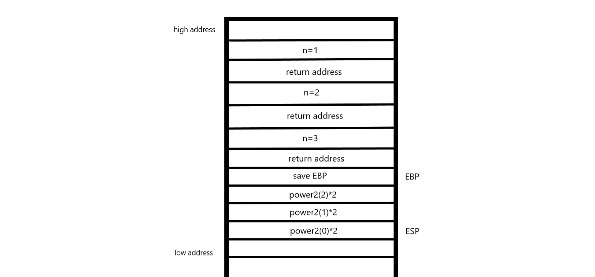

# 第六週筆記
* 程式的編譯、組譯、連結及載入流程
```
    高階語言(系統程式)
       ↓
    編譯器(系統軟體)
       ↓
    組合語言(系統程式)
       ↓
    組譯器(系統軟體)
       ↓
    目的檔
       ↓
    連結器(系統軟體)
       ↓
    執行檔
       ↓
    載入器(系統軟體)
       ↓
    記憶體

```
* 堆疊段
```
#include <stdio.h>
int power2(int n){
    if(n==0) return 1;
    return power2(n-1)*2;
}
int main(){
    int p = power2(3);
    printf("p=%d\n", p);
}

```


> 框架暫存器(EBP):現在的存取點 堆疊暫存器(ESP):目前堆疊的最後一個