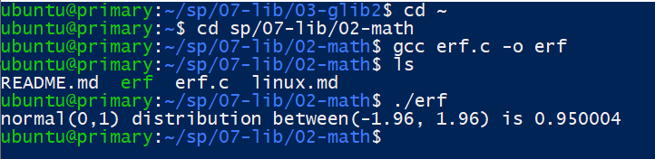
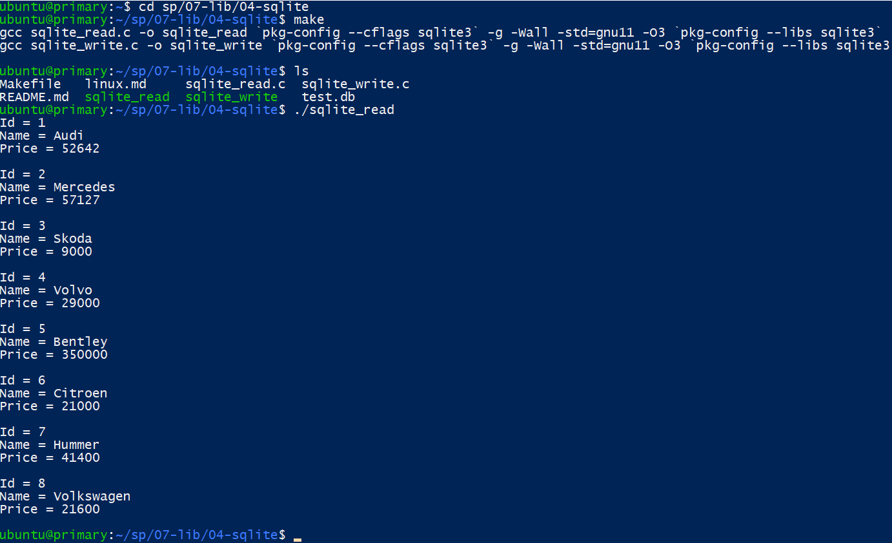
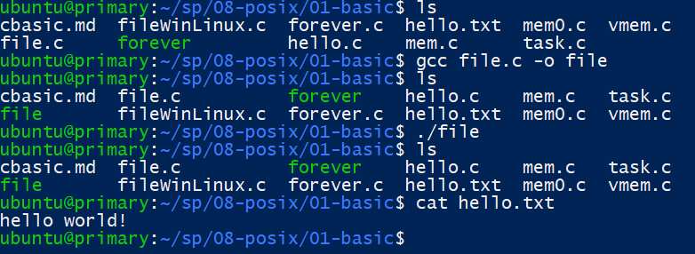

# 第八週筆記
* Download glib2
> apt-get install libglib2.0-dev  dev(開發版):給開發程式使用
* erf.c

* vim使用
```
i:進入編輯模式
Esc:離開編輯模式
o:插入一行
yy:複製一行
dd:刪除一行
cc:剪下一行
p:貼上

在非編輯模式下輸入 :wq 再 Enter，就會存檔和離開程式。

```
* sqlite_read

* forever.c
~[](week8-3.png)
* file.c

