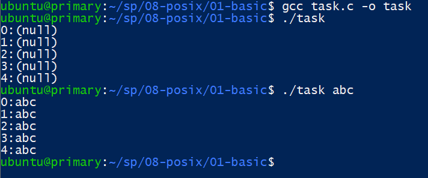
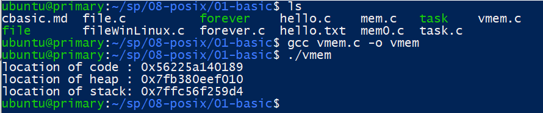
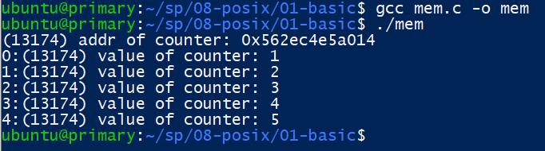
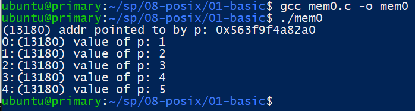
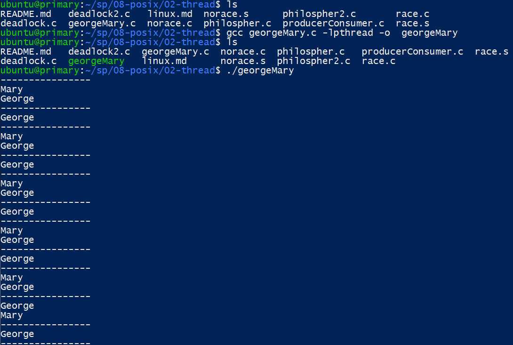

# 第九週筆記
* 作業系統五大功能
1. 行程管理:打造一個環境讓任何程式能不受干擾的執行
2. 記憶體管理:打造一個記憶體配置環境，當程式向系統請求記憶體時，就能獲得所需空間，且不需考慮其他程式
3. 輸出入系統:能將輸出入裝置包裝成系統函數，讓輸出入作業變容易使用
4. 檔案系統:能讓程式師及使用者輕鬆存取永久儲存裝置中的檔案
5. 使用者介面:讓程式師及使用者能輕鬆操作的環境

* 行程VS執行緒
```
行程:傳統的兩個行程通常擁有不同的記憶空間，在具有記憶體管理單元(MU:Memory Management Unit)的作業係中，兩個行程的記憶空間是完全獨立的，各自擁有自己的記憶體映射表。所以在行程切換的同時也必須更換映射表，這樣的動作會消耗許多時間。

執行緒:
    1.執行緒之間共用記憶體空間
    2.切換時不須映射表
    3.切換動做非常快速
```

* task

* vmem

* mem

* mem0

* georgeMary
